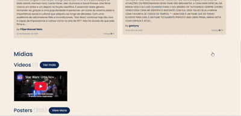

# 🎬 Movie Spec Page

Uma página detalhada de um filme(Star Wars), com informações vindas da API do [TheMovieDB](https://www.themoviedb.org/). O projeto exibe sinopse, elenco, trailers, imagens promocionais, avaliações e filmes recomendados ( tudo de forma responsiva e acessível).

> ⚠️ **Atenção:** Este projeto requer uma chave da API da TheMovieDB para funcionar. Veja a seção [🔑 API Key](#-api-key-importante).

## 📸 Prévia



## 🚀 Funcionalidades

- ✅ Busca de dados em tempo real da API do TheMovieDB
- 🎥 Exibição de vídeos do YouTube (trailers)
- 👥 Carrossel com elenco do filme
- 🖼️ Sessão com pôsteres e backdrops
- ⭐ Avaliações de usuários
- 📱 Layout responsivo para desktop e mobile
- ♿ Acessibilidade com uso de boas práticas e WAI-ARIA
- 🔄 Scroll horizontal com efeito blur (mobile)

## 🧪 Tecnologias

- HTML5 + CSS3
- Bootstrap 4
- JavaScript (ES6)
- API pública do TheMovieDB

## 🗂️ Estrutura de Pastas

movie-spec-page/
├── index.html
├── css/
│ └── style.css
├── js/
│ └── main.js
├── assets/
│ └── demo.gif (e outras imagens)
├── .gitignore
└── README.md


## 🔑 API Key (IMPORTANTE)

Este projeto utiliza a API da [TheMovieDB](https://www.themoviedb.org/), e **você precisará informar sua própria chave** para que ele funcione corretamente.

### 🔧 Como obter:

1. Crie uma conta gratuita em:  
   👉 [https://www.themoviedb.org/settings/api](https://www.themoviedb.org/settings/api)

2. Após obter sua chave, substitua o valor da constante no arquivo `js/main.js`:

   ```js
   // js/main.js
   const API_KEY = 'SUA_CHAVE_AQUI';
Atenção: A chave original foi removida por segurança. O projeto não funcionará até que você insira a sua.
📦 Como rodar o projeto
Clone este repositório:
git clone https://github.com/giuliatrevisan/movie-details-site.git
Acesse a pasta:
cd movie-spec-page
Abra o index.html no navegador (não é necessário servidor local):

Clique duas vezes no arquivo
ou
Use uma extensão como Live Server no VSCode

🙋‍♀️ Autora
Feito com 💻 e ☕ por Giulia Trevisan
